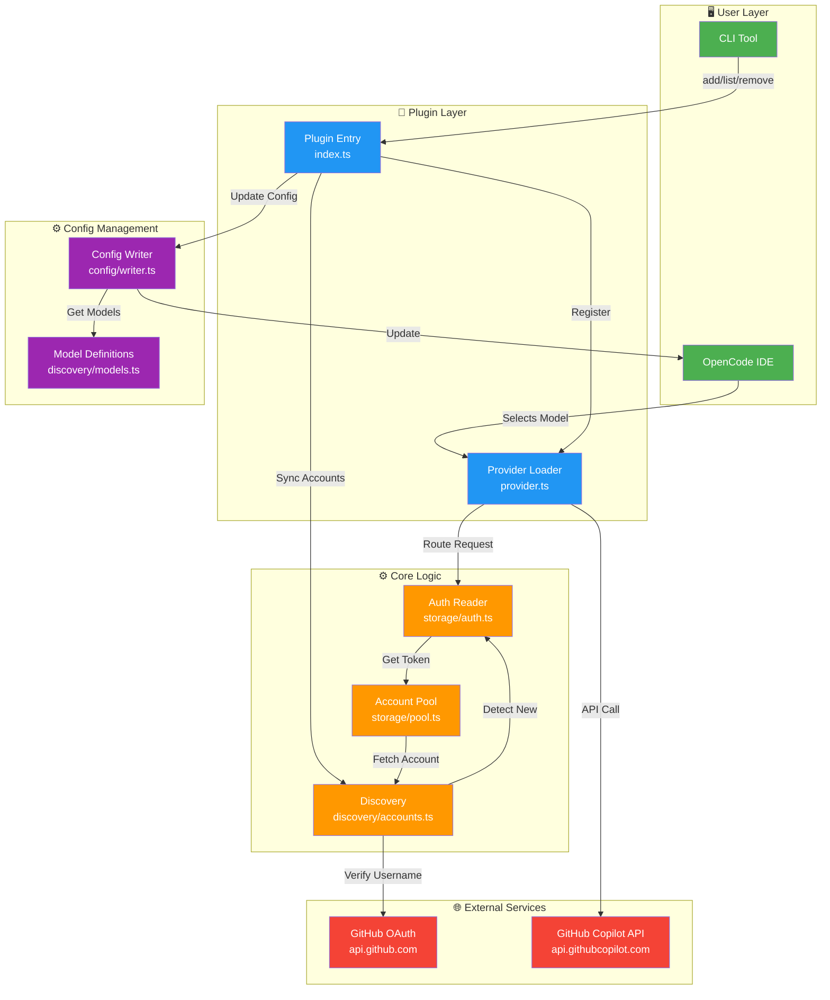
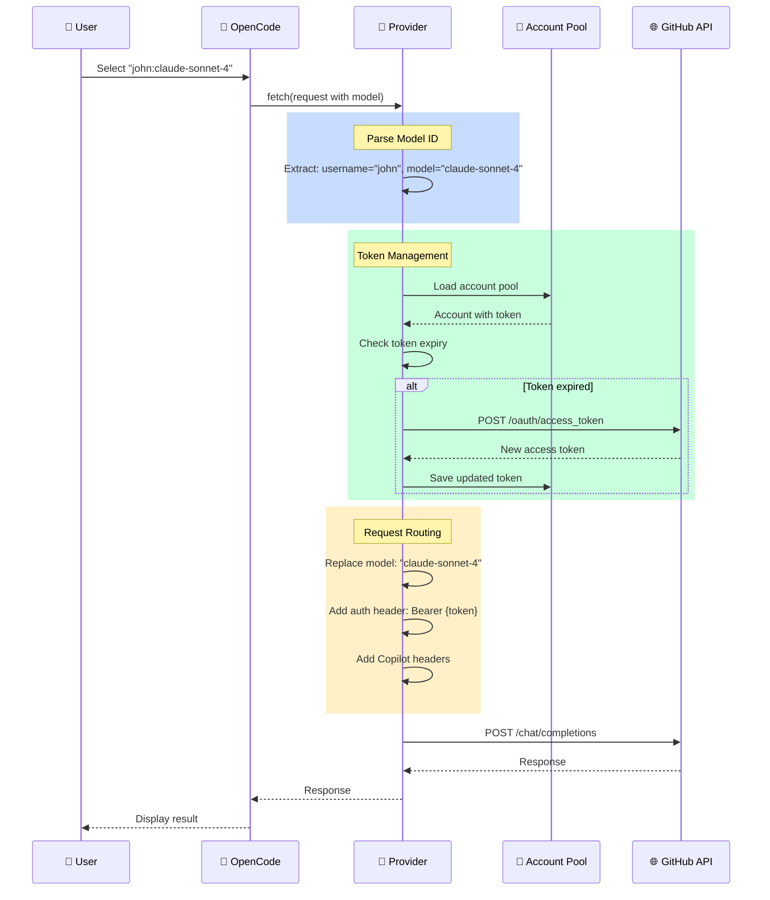
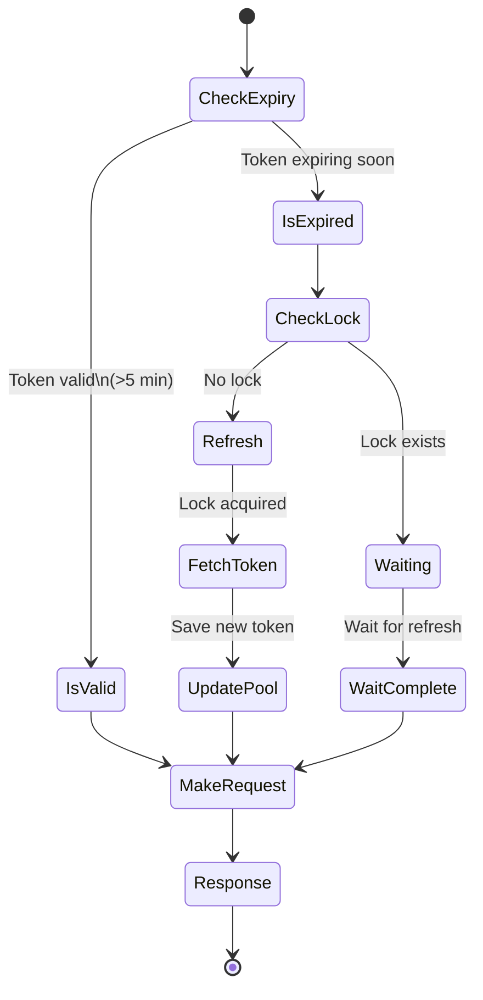
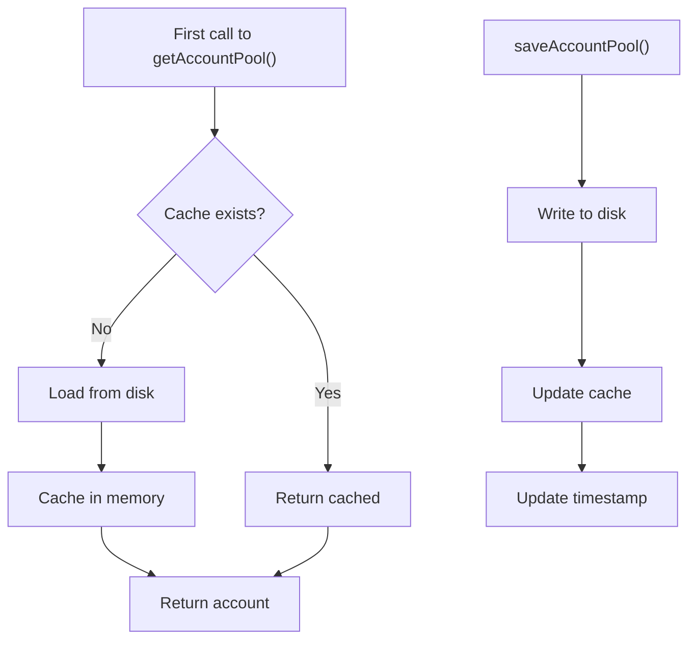
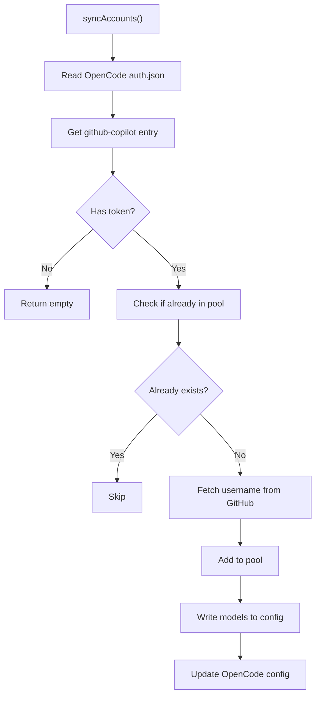

# Architecture

This document describes the architecture, design decisions, and technical implementation of opencode-copilot-multi.

## System Overview



## Request Flow

When a user selects a model in OpenCode, here's what happens:



## Component Architecture

### 1. Plugin Entry Point (`src/index.ts`)

**Responsibilities**:
- Register provider with OpenCode
- Setup account pool management
- Handle event hooks (session creation)
- Non-blocking initialization

**Key Features**:
- Lazy loading (no blocking calls)
- Background sync on session creation
- Auto-detect new accounts

**Flow**:
```
OpenCode starts
    ↓
Plugin entry called (async)
    ↓
Register "copilot-multi" provider
    ↓
Start background sync (non-blocking)
    ↓
Return immediately (non-blocking)
    ↓
On user request → Load provider
```

### 2. Provider (`src/provider.ts`)

**Responsibilities**:
- Custom fetch handler
- Model ID parsing (username:model → account lookup)
- Token refresh management
- Request routing to GitHub API

**Key Features**:
- Mutex pattern for token refresh (prevent concurrent refresh)
- 5-minute token refresh buffer
- Automatic token expiry handling
- Detailed logging

**Token Refresh Flow**:


### 3. Account Pool (`src/storage/pool.ts`)

**Responsibilities**:
- Persistent storage of accounts
- Lazy-loaded singleton pattern
- File integrity checks
- Automatic backup on corruption

**Data Structure**:
```json
{
  "version": 1,
  "accounts": [
    {
      "id": "hash(refresh_token)",
      "username": "john-dev",
      "displayName": "john-dev",
      "auth": {
        "type": "oauth",
        "access": "ghu_...",
        "refresh": "ghr_...",
        "expires": 1704067200000
      },
      "models": ["claude-sonnet-4", "gpt-4o", ...],
      "addedAt": 1704067200000,
      "lastUsed": 1704067200000
    }
  ],
  "lastUpdated": 1704067200000
}
```

**Storage Location**:
- Linux/macOS: `~/.local/share/opencode/copilot-multi-accounts.json`
- Windows: `%APPDATA%\opencode\copilot-multi-accounts.json`
- Permissions: 0600 (owner read/write only)

**Singleton Pattern**:


### 4. Account Discovery (`src/discovery/accounts.ts`)

**Responsibilities**:
- Read OpenCode's auth.json
- Extract GitHub username via API
- Detect available models
- Auto-sync accounts

**Discovery Flow**:


### 5. Config Writer (`src/config/writer.ts`)

**Responsibilities**:
- Update `opencode.json` / `opencode.jsonc`
- Add models with proper configuration
- Preserve existing config (non-destructive)
- Handle both .json and .jsonc formats

**Config Structure Added**:
```json
{
  "plugin": ["opencode-copilot-multi"],
  "provider": {
    "copilot-multi": {
      "models": {
        "username:model-id": {
          "name": "username: Model Display Name",
          "limit": {
            "context": 128000,
            "output": 16000
          },
          "modalities": {
            "input": ["text", "image"],
            "output": ["text"]
          }
        }
      }
    }
  }
}
```

### 6. CLI Tool (`src/commands/multi-copilot.ts` + `bin/cli.ts`)

**Commands**:

#### `list` / `ls`
- Display all configured accounts
- Show model count per account
- Show when each was added

#### `add`
- Launch `opencode auth login`
- Detect new GitHub Copilot account
- Add to pool
- Update OpenCode config

#### `remove <username>`
- Remove specific account
- Update OpenCode config

#### `clear [--force]`
- Remove all accounts
- With confirmation (unless `--force`)

#### `install`
- Register plugin in OpenCode config
- Register provider in auth.json
- Fallback for failed post-install

### 7. Model Definitions (`src/discovery/models.ts`)

**Features**:
- 15+ models defined
- Display names
- Context/output limits
- Input/output modalities

**Supported Models**:
- Claude Opus/Sonnet/Haiku
- GPT-4o/4-Turbo
- GPT-5
- o1/o1-mini/o3-mini
- Gemini 2.5 Pro / 3

## Technology Stack

```
Language:     TypeScript 5.0+
Runtime:      Node.js 18+
Module:       ESM (import/export)
Package Mgr:  npm
Build:        TypeScript compiler (tsc)

Dependencies:
├── @opencode-ai/plugin (peer)
├── zod (validation)
├── undici-types (fetch types)
└── (minimal deps - lightweight)

DevDependencies:
├── TypeScript
├── @types/node
└── @opencode-ai/plugin
```

## Design Patterns

### 1. Singleton Pattern (Account Pool)

**Purpose**: Ensure only one pool instance in memory

```typescript
let poolInstance: AccountPool | null = null;
let loadPromise: Promise<AccountPool> | null = null;

export async function getAccountPool(): Promise<AccountPool> {
  if (poolInstance) return poolInstance;
  
  if (!loadPromise) {
    loadPromise = loadPoolFromDisk().then(pool => {
      poolInstance = pool;
      return pool;
    });
  }
  
  return loadPromise;
}
```

**Benefits**:
- Single source of truth
- Avoid race conditions
- Efficient memory usage
- Easy cache invalidation

### 2. Mutex Pattern (Token Refresh)

**Purpose**: Prevent concurrent token refresh for same account

```typescript
const refreshLocks = new Map<string, Promise<void>>();

async function refreshTokenIfNeeded(account: Account): Promise<void> {
  // Check existing lock
  const existingLock = refreshLocks.get(account.id);
  if (existingLock) {
    await existingLock;
    return;
  }
  
  // Create lock
  const refreshPromise = (async () => {
    try {
      // Do refresh...
    } finally {
      refreshLocks.delete(account.id);
    }
  })();
  
  refreshLocks.set(account.id, refreshPromise);
  await refreshPromise;
}
```

**Benefits**:
- Thread-safe (single JS thread)
- Prevents duplicate API calls
- Handles concurrent requests gracefully

### 3. Lazy Loading Pattern

**Purpose**: Defer expensive operations until needed

**Applied In**:
- Plugin entry point (doesn't block OpenCode startup)
- Provider loader (only loads on first request)
- Account sync (background, non-blocking)

```typescript
// Entry point - returns immediately
export const plugin: Plugin = async ({ client }) => {
  // Start background sync (don't await)
  syncAccounts().catch(error => {
    logger.error('Sync failed', { error });
  });
  
  return {
    auth: {
      loader: async () => {
        // Called when provider first used
        const pool = await getAccountPool();
        return createProviderLoader();
      }
    }
  };
};
```

**Benefits**:
- Zero impact on OpenCode startup
- Responsive user experience
- Graceful error handling

### 4. Non-Destructive Config Update

**Purpose**: Update config without losing existing settings

```typescript
async function writeModelsToConfig(accounts: Account[]): Promise<void> {
  // 1. Read existing config
  const config = await readConfig();
  
  // 2. Preserve existing structure
  if (!config.provider) config.provider = {};
  if (!config.provider['copilot-multi']) {
    config.provider['copilot-multi'] = { models: {} };
  }
  
  // 3. Only update models
  config.provider['copilot-multi'].models = buildModels(accounts);
  
  // 4. Write back
  await writeConfig(config);
}
```

**Benefits**:
- Doesn't interfere with other plugins
- Safe concurrent updates
- Preserves user customizations

## Error Handling

### Custom Error Classes

```typescript
class AccountNotFoundError extends Error {}
class InvalidModelIdError extends Error {}
class TokenRefreshError extends Error {}
class PoolCorruptedError extends Error {}
```

### Error Recovery

1. **Token Refresh Fails**
   - Continue with existing token (if still valid)
   - Log error for debugging
   - Fail request with clear message

2. **Pool Corrupted**
   - Backup corrupted file
   - Create empty pool
   - User can re-add accounts

3. **Account Not Found**
   - Clear error message
   - Show available accounts
   - Suggest running `list`

## Security Considerations

### Token Management

1. **Storage**
   - Local file only (no cloud, no network)
   - File permissions: 0600
   - No env variables
   - No console output

2. **Refresh**
   - Automatic, transparent
   - 5-minute buffer before expiry
   - Mutex prevents race conditions
   - Secure OAuth flow

3. **Expiry**
   - `gho_*`: Never expires
   - `ghu_*`: 8 hours default
   - Auto-refresh transparent to user

### API Communication

1. **Headers**
   - Proper Authorization header
   - Copilot-specific headers
   - User-Agent identification

2. **Validation**
   - Model ID format validation
   - Account existence check
   - Token validity check

3. **Logging**
   - No tokens in logs
   - Account name logged only
   - Request/response logged
   - Debug info available

## Performance Considerations

### Lazy Loading
- Plugin doesn't block OpenCode startup
- Account pool loaded on first request
- Config updates asynchronous

### Token Refresh
- Mutex prevents duplicate API calls
- 5-minute buffer prevents constant refresh
- Concurrent requests share single refresh

### File I/O
- Singleton pattern (single read per session)
- Async operations (non-blocking)
- Batch updates when possible

### Memory
- Account pool cached in memory
- Models not duplicated
- Minimal dependencies

## Testing Strategy

### Unit Tests (Recommended)
```typescript
describe('Provider', () => {
  it('should parse model ID correctly', () => {
    const result = parseModelId('john:claude-sonnet-4');
    expect(result).toEqual({
      username: 'john',
      model: 'claude-sonnet-4'
    });
  });
});
```

### Integration Tests (Manual)
```bash
# Test full flow
npm run build
npm link
opencode-copilot-multi add
# Complete OAuth flow
opencode-copilot-multi list
# Verify account added
```

### Debugging
```bash
# Enable logging
tail -f ~/.local/share/opencode/log/copilot-multi.log

# Verbose git operations
GIT_SSH_COMMAND="ssh -v" git ...
```

## Deployment

### Build Process
```
src/
├── TypeScript files
└── bin/cli.ts
    ↓
tsc (TypeScript Compiler)
    ↓
dist/
├── Compiled JavaScript
└── Source maps
    ↓
npm publish
```

### Release Process
```
1. Update version in package.json
2. npm run build
3. Update CHANGELOG.md
4. git commit -m "bump: version x.x.x"
5. npm publish
6. Create GitHub Release
```

## Future Architecture Improvements

1. **Keychain Integration**
   - Use system keychain for token storage
   - More secure than 0600 files
   - Cross-machine sync potential

2. **Caching Layer**
   - Cache GitHub API responses
   - Reduce API calls
   - Improve performance

3. **Plugin Communication**
   - IPC between OpenCode and plugin
   - Faster account sync
   - Better error reporting

4. **Rate Limiting**
   - Per-account rate limit tracking
   - Backoff strategy
   - User notification

5. **Web Dashboard**
   - Visual account management
   - Usage analytics
   - Token monitoring

---

## References

- [OpenCode Plugin API](https://docs.opencode.ai/plugins)
- [GitHub OAuth](https://docs.github.com/en/authentication/connecting-to-github-with-ssh)
- [Node.js File System](https://nodejs.org/api/fs.html)
- [TypeScript Handbook](https://www.typescriptlang.org/docs/)
